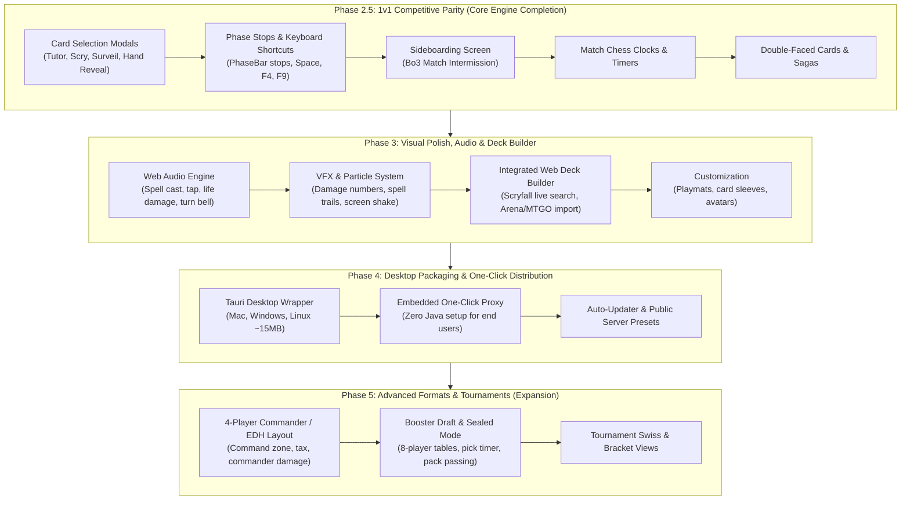

# Project Roadmap: Mage Alt Client

> **A Modern, Web-Based MTG Arena-Style Client for XMage**  
> *Last updated: 2026-08-20*

---

## 1. Vision & Architectural Philosophy

The goal of **Mage Alt Client** is to deliver a fast, modern, and beautiful client for *Magic: The Gathering* with an **MTG Arena aesthetic** (WebGL2 rendering, animated targeting, sound, smooth interaction) while leveraging the battle-tested, 10-year **XMage Java server** (`Mage.Server`) as the authoritative rules engine, card database (+25,000 cards), and multiplayer matchmaking backend.

### The 3-Tier Architecture
```
┌─────────────────────────┐          WebSocket JSON          ┌──────────────────────────┐      JBoss / TCP      ┌─────────────────────────┐
│     Web Client          │ ◄──────────────────────────────► │        Mage.Proxy        │ ◄───────────────────► │      XMage Server       │
│  (React 19 + PixiJS)    │   (Type-safe protocol schema)    │  (Java 17 / MageClient)  │   (Native protocol)   │  (1.4.61-V1 / Official) │
└─────────────────────────┘                                  └──────────────────────────┘                       └─────────────────────────┘
```

- **Zero Rules Re-implementation**: XMage handles all legality, priority checks, layers, triggers, timers, and state-based actions.
- **Clean Decoupling**: The Java proxy acts as a legitimate `MageClient`, translating JBoss serialization into clean, reflection-safe JSON.
- **Asynchronous State Machine**: The web client uses non-blocking reactive stores, monotonic state tracking, and floating UI dialogs to bridge XMage's synchronous Swing origins into modern web paradigms.

---

## 2. Current State Assessment (Verified & Completed)

The project has successfully conquered the most difficult engineering hurdles (protocol bridging, async feedback loops, mana payments, targeting):

| Milestone | Scope | Status | Verification & Evidence |
|---|---|---|---|
| **Phase 0: Proxy Bridge** | Java 17 proxy (`Mage.Proxy`), WebSocket gateway, cycle-safe JSON serializer, handshake buffer for `SHOW_USERMESSAGE`. | ✅ **Completed** | Full compatibility verified against `beta.xmage.today:17171` (XMage 1.4.61-V1). |
| **Phase 1: Web Foundation** | React 19 + TS + Vite + PixiJS 8. Lobby, room chat, real-time tables/users, Scryfall HD card cache (IndexedDB), full 1v1 board rendering & spectator mode. | ✅ **Completed** | 100% typecheck clean, live AI vs AI spectator matches working end-to-end. |
| **Phase 2: Interaction Engine** | London mulligan, priority loops (`GAME_SELECT`), visual targeting (animated dotted lines & pulsing glows), mana tapping & pool payment (`sendPlayerManaType`), floating non-blocking combat UI (attack/block & alpha strike), advanced spell interactions (X-costs, multi-target, modal choices, +1/+1 counters). | ✅ **Completed** | Validated via `human-test.mjs` (83 checks PASS) and Playwright E2E suites (*Blaze*, *Arc Trail*, *Boros Charm*, *Walking Ballista*). |
| **Quality & QA Foundation** | 105 unit tests (vitest, <1s), Java→TS JSON Schema codegen (`gen-types.mjs`), dual-mode Playwright E2E (deterministic FakeServer + Real XMage Stack with `SimPlayer` bots). | ✅ **Completed** | Zero-flake local iteration loop + continuous anti-drift contract testing. |

---

## 3. Feature Parity Matrix: Official XMage (Swing) vs. Mage Alt Client

| Category | Feature | Official XMage (Swing) | Mage Alt Client (Current) | Roadmap Phase |
|---|---|---|---|---|
| **Connectivity & Lobby** | Connect to Local / Custom / Public Server (`beta.xmage.today`) | ✅ Yes | ✅ Yes | Completed |
| | Real-time Table & User Broadcasts | ✅ Yes | ✅ Yes | Completed |
| | Room & Match Chat | ✅ Yes | ✅ Yes | Completed |
| | 1v1 Table Creation (Human vs Human / Human vs AI) | ✅ Yes | ✅ Yes | Completed |
| | Table Filters & Private Messaging (Whispers/PM) | ✅ Yes | ❌ No | Phase 3 |
| | Match Clocks / Visible Timers | ✅ Yes | 🟡 Backend-only | **Phase 2.5** |
| **Deck Management** | Predefined / JSON Deck Loading | ✅ Yes | ✅ Yes | Completed |
| | Full-featured In-App Deck Builder with Scryfall Filters | ✅ Yes (Local DB) | ❌ No | Phase 3 |
| | Text / MTG Arena / MTGO Deck Import & Export | ✅ Yes | ❌ No | Phase 3 |
| **1v1 In-Game Board** | Hand, Battlefield (Lands / Creatures / Non-creatures) | ✅ Yes | ✅ Yes (HD Art) | Completed (Surpasses Swing) |
| | Stack, Library, Graveyard, Exile | ✅ Yes | ✅ Yes | Completed |
| | Tap Rotations, Life Totals, Counters (+1/+1, loyalty) | ✅ Yes | ✅ Yes | Completed |
| | Graveyard / Exile Pile Inspector Overlays | ✅ Yes | ✅ Yes | Completed |
| | Double-Faced Cards (Transform, MDFC, Sagas) | ✅ Yes | 🟡 Front-face only | **Phase 2.5** |
| **In-Game Rules & Prompts** | Priority & Turn Passing (`GAME_SELECT`) | ✅ Yes | ✅ Yes | Completed |
| | Mana Payment (Tapping lands on board + color pool) | ✅ Yes | ✅ Yes | Completed |
| | Visual Targeting (Outlines, arrows to cards/players) | ❌ Crude lines | ✅ Dotted animated lines + Glow | Completed (Surpasses Swing) |
| | Complex Spells (X-costs, Modals, Multi-target) | ✅ Yes | ✅ Yes | Completed |
| | Interactive Combat (Declare Attackers / Blockers) | ✅ Yes | ✅ Yes (Floating UI) | Completed |
| | **Card Selection Lists (Tutors, Scry, Surveil, Hand Reveal)** | ✅ Yes (`ShowCardsDialog`) | ❌ No | **Phase 2.5 (Priority)** |
| | **Phase Stops & Priority Shortcuts (F4, F9, Space)** | ✅ Yes | ❌ No (Manual pass only) | **Phase 2.5 (Priority)** |
| | **Sideboarding Screen between Bo3 Matches** | ✅ Yes | ❌ No | **Phase 2.5 (Priority)** |
| | Multi-blocker Damage Assignment Order | ✅ Yes | 🟡 Auto-assigned | Phase 2.5 |
| **Presentation & Audio** | Sound Effects (Turn bell, life loss, spell cast, combat) | ✅ Basic | ❌ No | Phase 3 |
| | VFX & Animations (Spell cast arcs, screen shake, damage) | ❌ No | 🟡 Motion tweens | Phase 3 |
| **Distribution** | Desktop & Web Deployment | ❌ Heavy JRE required | 🟡 Web / ⬜ Tauri App | Phase 4 |
| **Advanced Formats** | 4-Player Commander / EDH (Command zone, tax, damage) | ✅ Yes | ❌ No (1v1 Layout) | Phase 5 |
| | Booster Draft & Sealed Tournaments (Pick timer, packs) | ✅ Yes | ❌ No | Phase 5 |

---

## 4. Phased Implementation Roadmap



---

### Phase 2.5: 1v1 Competitive Parity (Core Engine Completion)
*Objective: Make the web client 100% playable for all sanctioned 1v1 Constructed formats (Modern, Standard, Pioneer, Legacy, Vintage, Pauper).*

#### 2.5.1 Card Selection Modals (Tutors, Scry, Surveil, Hand Reveal) — **CRITICAL**
- **XMage Events**: `GAME_CHOOSE_CARDS`, `SHOW_CARDS`, `GAME_TARGET` with `cardsView1` lists.
- **Features**:
  - Modal card-grid overlay styled after MTG Arena.
  - Search library (Fetchlands, Demonic Tutor).
  - Scry / Surveil / Look at top N cards (allow reordering/placing on top or bottom).
  - Reveal hand effects (*Thoughtseize*, *Inquisition of Kozilek*): view opponent's hand in a dedicated reveal window and click to discard.
  - Graveyard / Exile selective interactions (reanimation, flashback picker).

#### 2.5.2 Phase Stops & Priority Shortcuts — **CRITICAL**
- **Features**:
  - Interactive stop markers on `PhaseBar`: click on specific steps (Upkeep, Draw, Precombat Main, Beginning of Combat, Declare Attackers, End of Combat, Postcombat Main, End Step) to set personal stops.
  - Standard MTG priority keyboard shortcuts:
    - **Space / Enter**: Yield current priority (pass).
    - **F4**: Pass priority until stack is non-empty or an opponent acts.
    - **F9**: Pass all priority until end of turn.
    - **Ctrl**: Hold full priority.

#### 2.5.3 Sideboard Screen (Best-of-3 / Best-of-5 Matches) — **HIGH**
- **Features**:
  - Intermission screen between match games when `GAME_SIDEBOARD` is received.
  - Two-column visual deck editor (Maindeck $\leftrightarrow$ Sideboard).
  - Drag-and-drop / single-click card swap with real-time deck size validation.
  - Countdown timer for sideboarding with "Submit Deck" action.

#### 2.5.4 Match Clocks & Priority Timers — **MEDIUM**
- **Features**:
  - Render active chess clocks for both players (turn timer & match timer).
  - Visual warning indicators when player time drops below critical thresholds (flashing amber/red).

#### 2.5.5 Double-Faced Cards (DFCs), MDFCs & Sagas — **MEDIUM**
- **Features**:
  - Card flip button / keyboard shortcut to preview and choose the back face of MDFCs in hand.
  - In-play transformation animations/transitions.
  - Saga layout with active chapter token overlay.

#### 2.5.6 Multi-Blocker Combat Damage Assignment — **LOW**
- **Features**:
  - Reorder blocker assignment dialog when an attacking creature is blocked by multiple defending creatures.

---

### Phase 3: Visual Polish, Audio & Integrated Deck Builder
*Objective: Transform the functional client into a premium, responsive MTG Arena-quality experience.*

#### 3.1 Audio Engine (Web Audio API)
- Sound FX for core interactions: card draw, card tap, spell cast whoosh, land drop, creature attack impact, life total counter tick, turn bell/notification chimes.
- Volume sliders in settings (Master, SFX, Ambient).

#### 3.2 VFX & Particle System (PixiJS)
- Spell resolution visual trajectories (arcs from hand $\to$ stack $\to$ battlefield/graveyard).
- Particle effects tailored to card colors (Red fire, Blue arcane sparkles, Green nature wisps, White holy light, Black dark smoke).
- Combat impact effects: screen shake on heavy damage, floating $-X$ life numbers.

#### 3.3 Integrated Web Deck Builder
- In-client Scryfall search with full syntax (`t:creature c:red cmc<=3 o:"haste"`).
- Visual deck view (stacks sorted by mana cost, color breakdown chart, mana curve histogram).
- One-click clipboard import/export in MTG Arena, MTGO, and `.dck` text formats.
- Sample hand generator (Goldfish opening hand simulator).

#### 3.4 Player Customization
- Selectable playmat background themes (Dark fantasy, Sci-fi, Minimalist wood, Animated nebula).
- Custom card back sleeves.

---

### Phase 4: Desktop Packaging & One-Click Distribution (Tauri)
*Objective: Provide a friction-free, zero-setup desktop application for non-technical users.*

#### 4.1 Tauri Native Wrapper
- Lightweight desktop application (<15 MB installer for Windows, macOS, and Linux).
- Native window chrome, hardware-accelerated WebGL viewport, and OS-native notifications when priority arrives while tabbed out.

#### 4.2 Embedded Proxy & JRE Management
- Bundle a headless, ultra-stripped OpenJDK 17 runtime + `mage-proxy.jar`.
- One-click launcher: automatically boots the local proxy in the background, handles port binding, and connects the UI instantly without user intervention.
- Preset selector: "Official Public Server (`beta.xmage.today`)" vs "Local Server" vs "Custom Server".

#### 4.3 Seamless Auto-Updater
- In-app background update downloads when new proxy or web releases are published.

---

### Phase 5: Advanced Game Modes & Tournaments (Expansion)
*Objective: Extend the platform to support MTG's most popular casual and limited formats.*

#### 5.1 4-Player Commander (EDH) / Brawl
- 4-quadrant dynamic board layout with individual player life totals, mana pools, and status bars.
- Dedicated Command Zone for each player displaying Commander cards.
- Trackers for Commander Tax ($+2$ per cast) and Commander Damage matrices (tracking damage dealt by each commander to each player).
- Turn order ring visualizer.

#### 5.2 Booster Draft & Sealed Tournaments
- 8-player draft table room with synchronous pick timers.
- Booster pack opening animation and card pick selection grid.
- Pack passing indicators (Pack 1 Left, Pack 2 Right, Pack 3 Left).
- Integrated 40-card limited deck builder during deckbuilding rounds.

#### 5.3 Swiss & Single Elimination Tournament Brackets
- Real-time tournament lobby with bracket visualization, pairing announcements, and standings tables.

---

## 5. Technical Complexity & Effort Matrix

| Phase | Milestone | Technical Complexity | Core Dependencies |
|---|---|---|---|
| **Phase 2.5** | Card Selection Modals | 🟡 Medium | React Card Grid, `GAME_CHOOSE_CARDS` mapper |
| **Phase 2.5** | Phase Stops & F4/F9 Shortcuts | 🟡 Medium | `PhaseBar` state, key listener, auto-pass logic |
| **Phase 2.5** | Sideboard Screen | 🟢 Low-Medium | 2-column drag-drop UI, `GAME_SIDEBOARD` action |
| **Phase 2.5** | Match Clocks | 🟢 Low | Client-side countdown syncing with server updates |
| **Phase 2.5** | Double-Faced Cards / Sagas | 🟢 Low-Medium | Scryfall back-face cache, card hover flip |
| **Phase 3** | Audio Engine | 🟢 Low | Web Audio API / Howler.js, sound asset pack |
| **Phase 3** | VFX & Particle System | 🟡 Medium | PixiJS 8 particle emitter & tween engine |
| **Phase 3** | In-App Deck Builder | 🟡 Medium | Scryfall REST API search, text format parsers |
| **Phase 4** | Tauri Desktop Launcher | 🟢 Low-Medium | Tauri 2.0, Rust process launcher for Java JAR |
| **Phase 5** | 4-Player Commander Layout | 🔴 High | Complete board geometry overhaul (4 quadrants) |
| **Phase 5** | Booster Draft & Tournament System | 🔴 High | Multi-client draft synchronization, draft timers |

---

## 6. Execution Guidelines

1. **Protocol-First Rule**: Never mutate client state optimistically without an authoritative server update. Player actions are intents sent to the proxy; the resulting `GameView` dictates the UI state.
2. **Schema Invariant**: Whenever proxy Java event models change, execute `node scripts/gen-types.mjs --validate` to keep TypeScript contract definitions strictly in sync.
3. **Dual-Testing Requirement**:
   - Fast UI/logic changes must pass `npm run test` (vitest) and `npm run test:e2e:fake` (Playwright against FixtureServer).
   - Core protocol/interaction changes must pass `node scripts/test.mjs` against the live stack with `SimPlayer` bots.
4. **Zero Flake Policy**: Avoid canvas byte-diff comparisons in E2E tests. Assert against deterministic scene state exposed on `window.__mageScene`.


### 1. Morfología de Cartas Especiales (MDFCs, Transformables, Aventuras, Sagas)

  En Magic moderno, muchas cartas no son un rectángulo estático con 1 sola cara:

  • Cartas de Doble Cara (MDFCs / Transformables / Hombres Lobo / Batallas): Valakut Awakening, Delver of Secrets, Invasion of Zendikar.
  • Aventuras y Cartas Divididas (Split / Aftermath): Brazen Borrower // Petty Theft, Fire // Ice.
  • Sagas y Clases: Tienen capítulos I, II, III o niveles que avanzan con contadores.
  • Fichas (Tokens): Criaturas, Tesoros, Comida, Pistas, Mapas, Sangre.

    ┌──────────────────────────┐           ┌──────────────────────────┐
    │ [Delver of Secrets]  (U) │           │ [Insectile Aberration]   │
    │ 1/1 Creature - Wizard    │  ──(⟲)──▶ │ 3/2 Creature - Insect    │
    │ At the beginning of...   │   Flip    │ Flying                   │
    │                    [ ⟲ ] │           │                    [ ⟲ ] │
    └──────────────────────────┘           └──────────────────────────┘

  #### Cómo se estandariza (Patrón MultiFaceCard):

  • En datos: XMage ya expone en CardView los campos secondCardFace, isTransformed, isToken y counters.LORE.
  • En UI:
      1. Un botón flotante ⟲ (o atajo de teclado / hover) en la esquina de la carta para previsualizar la otra cara en mano y cementerio.
      2. En el campo de batalla, si isTransformed === true, se renderiza automáticamente la textura de la cara B (Scryfall lo indexa como card_faces[1]).
      3. Para Sagas y Clases, una insignia (badge) sobre la carta con el capítulo actual (ChapterBadge: [II]).

  ──────
  ### 2. Jerarquía de Anexos (Attachments: Auras, Equipos, Mutar)

  Cuando juegas un Aura (Pacifism) o un Equipo (Shadowspear), se "anexan" a una criatura. En cartas de Ikoria (Mutate), varias cartas se apilan físicamente debajo de la criatura líder.

    ┌──────────────────────────────┐
    │  ┌───────────────────────┐   │  (Shadowspear - Equipo)
    │  │ ┌───────────────────┐ │   │
    │  │ │                   │ │   │
    │  │ │  Tarmogoyf (5/6)  │ │   │  (Criatura anfitriona)
    │  │ │                   │ │   │
    │  │ └───────────────────┘ │   │
    │  └───────────────────────┘   │
    └──────────────────────────────┘

  #### Cómo se estandariza (Patrón AttachmentAnchor):

  • En datos: XMage envía en cada permanente attachedTo: UUID o attachments: UUID[].
  • En UI:
      1. En lugar de ocupar un slot independiente en el battlefield, las cartas anexadas se renderizan escalonadas ligeramente detrás de la criatura anfitriona (desplazadas 10px arriba/derecha).
      2. Si la criatura anfitriona se gira (tap) o ataca, todos sus anexos se mueven junto a ella como un único grupo.

  ──────
  ### 3. Indicadores de Estado Global y Marcadores de Jugador

  Además de las vidas y el maná, Magic tiene estados persistentes globales y contadores que afectan la partida:

  • Contadores en jugadores: Veneno (Poison ≥10 = derrota), Energía (EE), Experiencia, Radiación (Rad counters).
  • Estados de designación global:
      • El Monarca (The Monarch 👑).
      • La Iniciativa / Mazmorras (The Initiative / Dungeons 🏰).
      • Día / Noche (☀️ / 🌙).
      • Bendición de la ciudad (City's Blessing).
  • Emblemas de Planeswalkers: Habilidades pasivas permanentes (emblemas de Teferi, Chandra, etc.).

  #### Cómo se estandariza (Patrón PlayerBadgeStrip & EmblemTray):

  • En datos: PlayerView incluye counters.POISON, isMonarch, hasCitysBlessing, y GameView.emblems.
  • En UI: Una barra compacta de chips/píldoras junto a la vida del jugador:
  [ 💖 20 ] [ 💀 3 ] [ ⚡ 4 ] [ 👑 Monarca ] [ ☀️ Día ]
  Al hacer hover sobre un emblema, se despliega la carta en grande.
  ──────
  ### 4. Iconografía de Habilidades Clave (Keyword Badges estilo MTG Arena)

  En una partida con 15 criaturas en mesa, leer el texto de cada carta para saber si tiene Volar, Toque Mortal o Arrollar satura al jugador.

    ┌────────────────────────┐
    │  Questing Beast   4/4  │
    │                        │
    │   [🪽] [⚡] [☠️] [🛡️]  │  ◄── Badges visuales sobre el frame
    └────────────────────────┘

  #### Cómo se estandariza (Patrón KeywordBadgeSet):

  • En datos: CardView.rules y CardView.abilities ya contienen las palabras clave parseadas.
  • En UI: Un conjunto de micro-iconos svg sobre la esquina inferior izquierda de la criatura:
      • 🪽 Volar / Alcance (Flying / Reach)
      • ⚡ Prisa / Dañar primero (Haste / First Strike)
      • ☠️ Toque mortal (Deathtouch)
      • 🦏 Arrollar (Trample)
      • 🛡️ Vigilancia / Antimaleficio (Vigilance / Hexproof / Ward)
      • 💖 Vínculo vital (Lifelink)

  ──────
  ### 5. Información Revelada / Cartas Conocidas (Known Information Tray)

  En Magic competitivo, si le lanzas un Thoughtseize al rival y ves su mano, esas cartas son información pública para ti hasta que las juegue o robe cartas nuevas. En el cliente oficial de Java Swing tienes que acordarte o mirar el log.

    ┌────────────────────────────────────────────────────────┐
    │  Mano del Oponente: [ 🂠 ] [ 🂠 ] [ 🂠 ]                 │  (3 cartas ocultas)
    │  Cartas Conocidas:  [ Bolt ] [ Fatal Push ]            │  (Reveladas previamente)
    └────────────────────────────────────────────────────────┘

  #### Cómo se estandariza (Patrón KnownHandTracker):

  • En datos: XMage guarda en PlayerView.revealedHand las cartas que han sido mostradas.
  • En UI: Una fila en miniatura justo encima de la mano oculta del rival mostrando las cartas que sabemos con certeza que tiene.
  ──────
  ### Resumen de la Arquitectura de Componentes

  Con estas 5 estandarizaciones adicionales, el sistema queda completamente modular y escalable:

   Componente Estándar                                                               | Resuelve                                                                          | Complejidad de Implementación
  -----------------------------------------------------------------------------------|-----------------------------------------------------------------------------------|----------------------------------------------------------------------------------
   MultiFaceCard                                                                     | MDFCs, Transform, Hombres Lobo, Sagas, Aventuras                                  | 🟢 Baja (Botón Flip + textura alternativa)
   AttachmentAnchor                                                                  | Auras, Equipos y Mutate agrupados                                                 | 🟢 Baja (CSS / Posicionamiento relativo)
   PlayerBadgeStrip                                                                  | Veneno, Energía, Monarca, Día/Noche, Emblemas                                     | 🟢 Baja (Iconos de estado)
   KeywordBadges                                                                     | Volar, Toque Mortal, Arrollar, Prisa, etc.                                        | 🟢 Baja (Iconos SVG en el sprite/card)
   KnownHandTracker                                                                  | Cartas reveladas tras Thoughtseize / Scry                                         | 🟢 Baja (Mini-bandeja de cartas)

  Todo esto se conecta directamente a campos que GameView ya envía desde Java, sin necesidad de tocar el servidor.